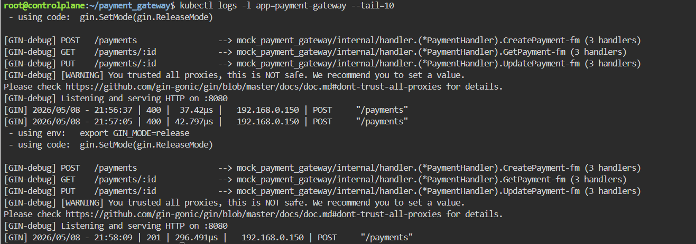

# REST Service in GO

Il progetto realizza una semplice API REST in Go che simula un sistema di pagamenti in-memory.
Il microservizio è containerizzato con Docker e pronto per l'orchestrazione su Kubernetes.

---

# Panoramica
Questo progetto dimostra un ciclo completo di sviluppo Cloud-Native, focalizzandosi sulla sicurezza del runtime e sull'automazione del deployment.

---

## Tecnologie utilizzate

- Go
- GoLand IDE
- Gin Web Framework
- UUID
- Map in-memory come storage
- sync.RWMutex per gestione concorrenza
- Containerizzazione: Docker
- CI/CD: GitHub Actions
- Registry: GitHub Container Registry
- Orchestrazione: Kubernetes (Deployment, Service, SecurityContext)
- Strumenti di Intelligenza Artificiale per configurazioni docker e kubernetes

---

# Sicurezza e Ottimizzazione

User Least Privilege: Il container non esegue come root. Viene utilizzato un utente dedicato con UID 10001.

Immagine Distroless/Alpine: Utilizzo di Alpine Linux per ridurre la superficie di attacco e mantenere l'immagine sotto i 50MB.

Multi-stage Build: Separazione tra ambiente di compilazione e runtime per evitare di includere codice sorgente e toolchain nell'immagine finale.

---

## Funzionalità

- Creazione pagamento
- Recupero pagamento per ID
- Aggiornamento stato pagamento
- Stati supportati: PENDING, SUCCESS
- Storage in-memory thread-safe

---

## Architettura Applicazione

- **Handler**
    - Gestione delle richieste HTTP
    - Parsing input (JSON / path params)
    - Simile ai Controller in Spring

- **Service**
    - Logica di business
    - Gestione stato pagamento
    - Validazioni

- **Storage**
    - Map in-memory
    - Protezione con mutex per concorrenza

---

## Architettura Kubernetes
I manifesti inclusi nella cartella k8s/ configurano:

- Deployment: 2 Repliche per garantire alta affidabilità.
- Resources: Limiti di CPU e Memoria impostati per evitare il "Noisy Neighbor" effect.
- Service: Un bilanciatore di carico interno (ClusterIP) per la comunicazione tra microservizi.

---

## Come avviare il progetto

kubectl apply -f k8s/

kubectl get pods 

---

## API e esempi CURL (Linux)

### Crea pagamento

POST /payments 
- curl -X POST http://localhost:8080/payments -H "Content-Type: application/json" -d '{\"amount\":1000,\"currency\":\"EUR\"}'

### Recupera pagamento

GET /payments/{id}
- curl http://localhost:8080/payments/{id}
 
### Aggiorna pagamento

PUT /payments/{id}

- curl -X PUT http://localhost:8080/payments/{id}

---

## CI/CD

Il progetto include un workflow di GitHub Actions che:

1. Esegue la build del codice Go.

2. Effettua il login sicuro su ghcr.io.

3. Costruisce l'immagine Docker taggandola come latest.

